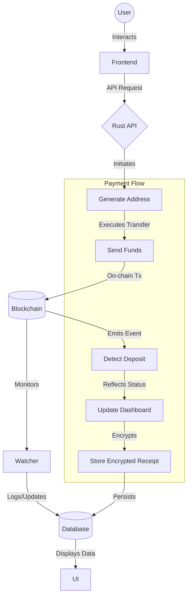

# Data Flow

The data flows through the system in the following high-level sequence:
**User → Frontend → Rust API → Blockchain → Watcher → Database → UI**

---

## Payment Flow

The specific life cycle of a transaction is detailed below:

1. **Generate address**
2. **Send funds**
3. **Detect deposit**
4. **Update dashboard**
5. **Store encrypted receipt**

---

## Architecture Diagram

