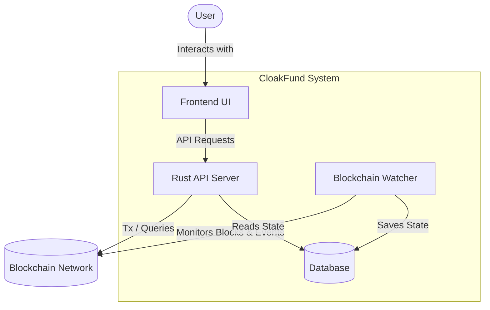
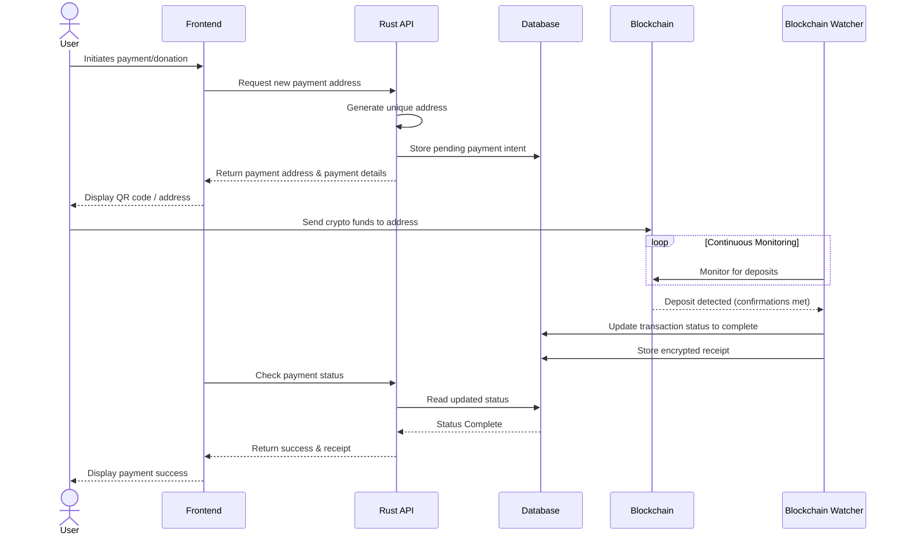

# Data Flow

This document details the high-level architecture and data flow for the CloakFund platform.

## High-Level Architecture

The core data flow moves from the user interfaces down to the blockchain, while a dedicated watcher service observes the blockchain to update the application state asynchronously.

---

## Payment Flow

The payment flow involves setting up an isolated deposit address and observing it for incoming funds

### 1. Address Generation

- **Frontend:** Requests a new, unique deposit address for a specific user or campaign.
- **Rust API:** Securely generates the receiving address and tracks the intent in the database.

### 2. Transaction & Observation

- **User:** Sends crypto funds from their personal wallet to the generated deposit address.
- **Watcher:** Continuously scans the blockchain for new blocks and transactions to the generated addresses.

### 3. Settlement

- **Watcher:** Once a valid deposit is detected, it updates the transaction state and stores an encrypted receipt.
- **Frontend:** Recieves the updated status from the Backend API and updates the UI.

